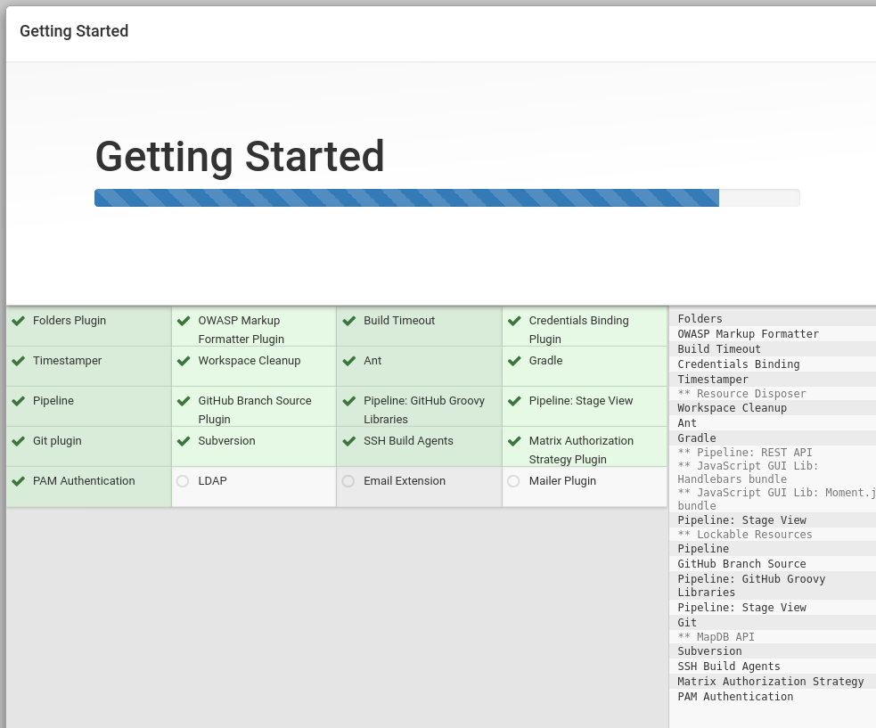
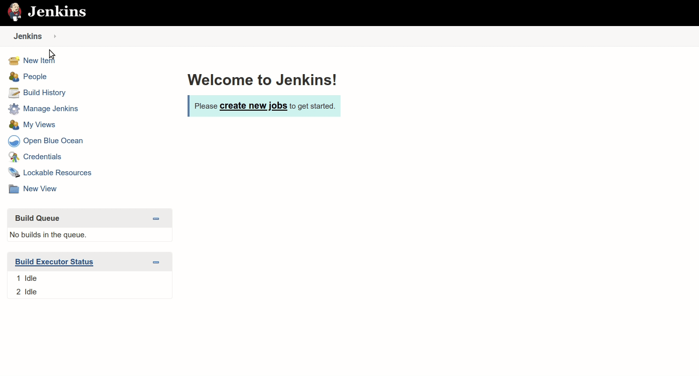
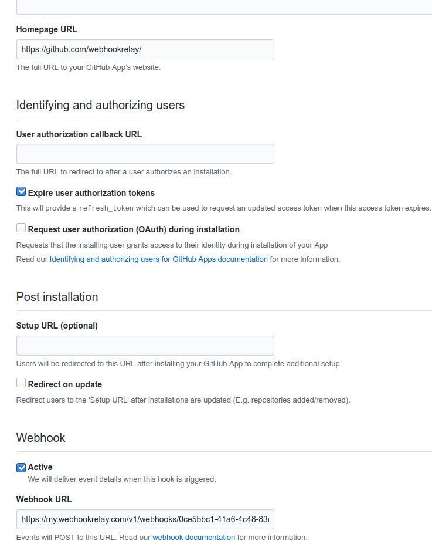
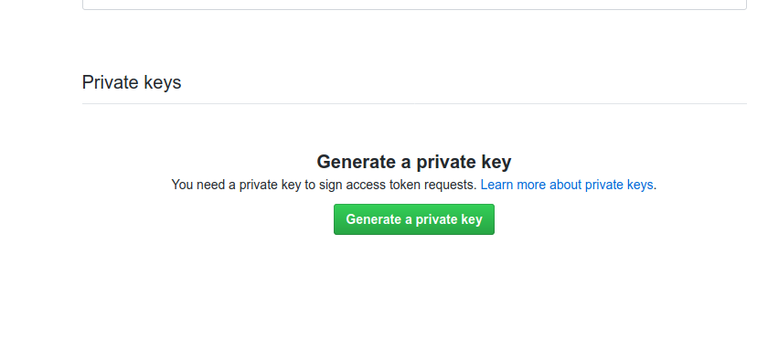
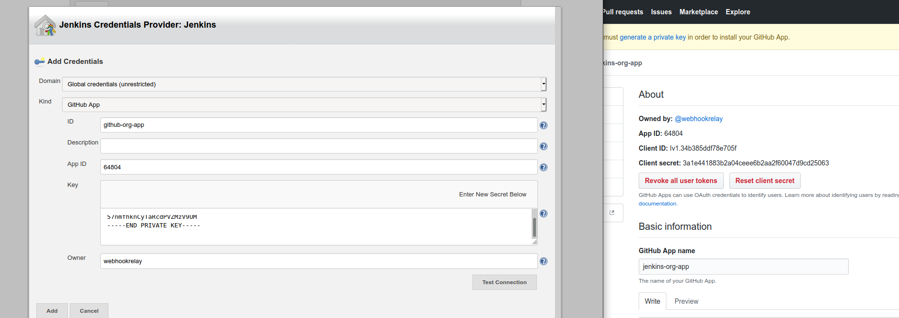
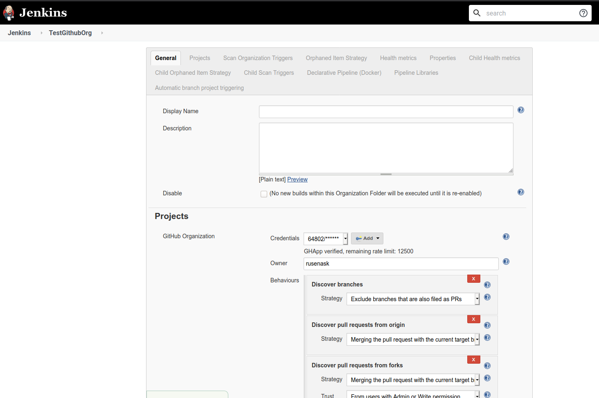

```
docker network create jenkins
```

```
docker volume create jenkins-docker-certs
docker volume create jenkins-data
```

Set up docker dind:

```
docker container run --name jenkins-docker --rm --detach \
  --privileged --network jenkins --network-alias docker \
  --env DOCKER_TLS_CERTDIR=/certs \
  --volume jenkins-docker-certs:/certs/client \
  --volume jenkins-data:/var/jenkins_home \
  --publish 2376:2376 docker:dind
```




## Setting up Github configuration

While Jenkins is getting installed, configure Github integration.

### Configure Webhook Relay routing

We will need to accept public webhooks and route to `/github-webhook/` path:

```
relay forward -b jenkins-demo-plugin http://localhost:8080/github-webhook/
```

Output should look like this:

```
relay forward -b jenkins-demo-plugin http://localhost:8080/github-webhook/
Forwarding: 
https://my.webhookrelay.com/v1/webhooks/0ce5bbc1-41a6-4c48-83cd-eefe6db24c7c -> http://localhost:8080/github-webhook/
Starting webhook relay agent... 
2020-05-13 15:48:50.414	INFO	using standard transport...
2020-05-13 15:48:50.513	INFO	webhook relay ready...	{"host": "my.webhookrelay.com:8080", "buckets": ["9a7f7347-d259-4dbd-82a0-0e3b1d9e527d"]}
```

By default, agent will start relaying webhooks. For production use either install relay agent as a service or use Docker container.

### Configure Jenkins Github integration

First, go to **Manage Jenkins** -> **Configure System**



And enter our public endpoint for Jenkins: https://my.webhookrelay.com/v1/webhooks/0ce5bbc1-41a6-4c48-83cd-eefe6db24c7c (just replace with your unique endpoint):


### Configure Jenkins authentication to Github

There are several ways authentication can be achieved but the recommended way is via Github App. A doc that describes it can be found here: https://github.com/jenkinsci/github-branch-source-plugin/blob/master/docs/github-app.adoc.

In short:
1. Go to https://github.com/ and then to your organization settings
2. Fill in name: Jenkins - teamName
3. Set **Webhook URL** to your public input endpoint (*https://my.webhookrelay.com/v1/webhooks/.....*)



4. Add permissions:
   - Commit statuses: Read and Write
   - Contents: Read-only (to read the Jenkinsfile and the repository content during git fetch). You may need "Read & write" to update the repository such as tagging releases
   - Metadata: Read-only
   - Pull requests: Read-only
   - Webhooks: Read and Write
5. Click "Create GitHub App"
6. Generate a private key that Jenkins can then use to authenticate (after you click it, you should get a download prompt):



7. Once you have it, use this terminal command (just replace the filename with yours) to convert it into a format that Jenkins can use:

  ```
  openssl pkcs8 -topk8 -inform PEM -outform PEM -in key-in-your-downloads-folder.pem -out converted-github-app.pem -nocrypt
  ```

8. Install the GitHub app: from the install app section of newly created app, install the app to your organization.

9. From the Jenkins main page click 'Credentials', pick your credentials storage (normally 'global') and click 'Add credentials'. Fill out the form:
  - Kind: GitHub app
  - ID: i.e. github-app-<team-name>
  - App ID: the github app ID, it can be found in the 'About' section of your GitHub app in the general tab.
  - API endpoint (optional, only required for GitHub enterprise this will only show up if a GitHub enterprise server is configured).
  - Key: click add, paste the contents of the converted private key
  - Advanced: (optional) If you’ve installed your same GitHub app on multiple organizations you need the next step
  - Owner: the name of the organisation or user, i.e. jenkinsci for https://github.com/jenkinsci
  - Click OK



### Test Github Org plugin

Follow instructions here on configuring the pipeline https://docs.cloudbees.com/docs/admin-resources/latest/plugins/github-branch-source:



It should scan your repositories and create projects. We will be using this current repository to create a Jenkinsfile and push it:

```
pipeline {
    agent any
    stages {
        stage('Build') {
            steps {
                echo 'Building..'
            }
        }
        stage('Test') {
            steps {
                echo 'Testing..'
            }
        }
        stage('Deploy') {
            steps {
                echo 'Deploying....'
            }
        }
    }
}
```